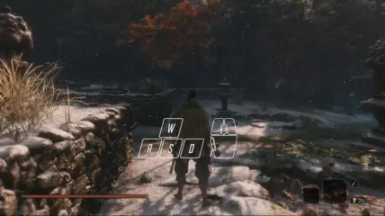

# Battle Instinct

Battle Instinct is a MOD for *Sekiro: Shadow Dies Twice*. It gives players the ability to perform multiple combat arts using directional inputs.

The MOD supports both keyboard & mouse and game controllers.

## Install

Click link below to download the MOD.

[![[DOWNLOAD]](https://img.shields.io/badge/DOWNLOAD-battle--instinct__x64.zip-blue)](https://github.com/dec32/sekiro-battle-instinct/releases/latest/download/battle-instinct_x64.zip)

To install the MOD, simply unzip the archive into the game directory (usually `C:\Program Files (x86)\Steam\steamapps\common\Sekiro`). You should have the following 2 files next to `sekiro.exe`:

1. `dinput8.dll`
2. `battle_instinct.cfg`


If the game is already modded with MOD Engine or any other MOD that utilizes `dinput8.dll`. You can rename the **other** `.dll` files into `dinput8_{whatever_you_like}.dll`. The MOD will automatically chain load the renamed `.dll` files for you. For example you may have:

```
Sekiro/
├─ dinput8.dll             # that comes from the Battle Instinct MOD
├─ dinput8_debug.dll       # that comes form the Debug Menu MOD
├─ dinput8_fps_unlock.dll  # that comes from the FPS Unlock MOD
├─ dinput8_mod_engine.dll  # that comes from the MOD Engine
├─ sekiro.exe
├─ ...
```


## Use

Press <kbd>Block</kbd> + <kbd>Attack</kbd> to perform the default combat art.


**Hold** a direction input while pressing <kbd>Block</kbd> + <kbd>Attack</kbd> performs the combat art that is bind to that direction. This is similar to how you perform Nightjar Slash Reversal in the vanilla game.


You can also **release** the input and press <kbd>Block</kbd> + <kbd>Attack</kbd> right after to perform the same combat art. This is similar to how you perform special moves in fighting games.


A combat art can be bind to multiple direction inputs. When performing such combat arts. <kbd>Block</kbd> can be omitted.




## Customize

The MOD comes with a configuration file that looks like this:
```
# This is a line of comment
5300  Ichimonji
5600  Floating Passage  ∅
5200  Nightjar Slash    ↑
7600  Shadowfall        ↑↑
```

The first row of the table are the UIDs of the combat arts. Do NOT modify them. The last row specifies how you perform the combat arts. In the last row you can write:

1. Nothing, which means this combat art is ignored.
2. `∅`, which means this is the default combat art.
3. A sequence of `↑`/`→`/`↓`/`←`, which spells the corresponding directional inputs.

> [!NOTE] 
> Binding two **adjecent** direction inputs (such as `↑→`) to a combat art is not recommended because you use these kind inputs to walk around.

