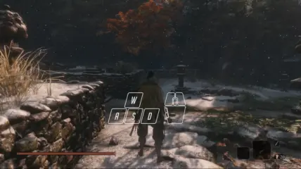
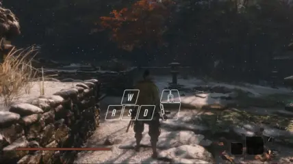
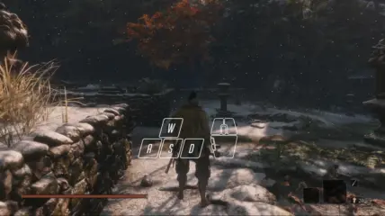

# Battle Instinct

Battle Instinct is a MOD for *Sekiro: Shadow Dies Twice*. It gives players the ability to use combat arts and prosthetic tools with **motion inputs**, without manually switching between them.

The MOD supports both MNK and gamepads.

## Install

Click link below to download the MOD.

[![[DOWNLOAD]](https://img.shields.io/badge/DOWNLOAD-battle--instinct.zip-blue)](https://github.com/dec32/sekiro-battle-instinct/releases/latest/download/battle-instinct.zip)

To install it, unzip the archive into the game directory (usually `C:\Program Files (x86)\Steam\steamapps\common\Sekiro`). You should have the following 2 files next to `sekiro.exe`:

1. `dinput8.dll`
2. `battle_instinct.cfg`

## Solve `dinput8.dll` Conflict

If you have MOD Engine or any other MOD that utilizes `dinput8.dll` installed, rename the **other** `dinput8.dll` files to `dinput8_{whatever_you_like}.dll`. For example you may have:

```
Sekiro/
├─ dinput8.dll             # that comes from the Battle Instinct MOD
├─ dinput8_debug.dll       # that comes form the Debug Menu MOD
├─ dinput8_fps_unlock.dll  # that comes from the FPS Unlock MOD
├─ dinput8_mod_engine.dll  # that comes from the MOD Engine
├─ sekiro.exe
└─ ...
```

The MOD will automatically chain load the renamed `.dll` files for you.


## Use

Press <kbd>Block</kbd> + <kbd>Attack</kbd> to perform the default combat art.



**Hold** a motion input and pressing <kbd>Block</kbd> + <kbd>Attack</kbd> performs the combat art bound to that direction. This is similar to how you perform Nightjar Slash Reversal in the vanilla game.



A combat art can also be bound to a sequence of motion inputs. When performing such combat arts, <kbd>Block</kbd> can be omitted, and the motion inputs can be **released** before attacking.



Prosthetic tools follow similar principles.

## Customize

You can customize your control scheme by editing `battle_instinct.cfg`. Here's a short example:

```
# This is a line of comment
5300  Ichimonji
7100  Ichimonji: Double  ∅
5200  Nightjar Slash     ↑
7600  Shadowfall         ↑↑
70000 Loaded Shuriken
70500 Lazulite Shuriken  ∅
78300 Spiral Spear       ↑↑
```

The file is a plain text table formatted with whitespace characters. The first column stores the UIDs of the skills (combat arts or prosthetic tools). The last column specifies how you perform the skills. In the last column you can write:

1. Nothing, which means this skill is ignored.
2. `∅`, which means this is the default skill.
3. A sequence of `↑`/`→`/`↓`/`←`, which spells the corresponding motion inputs.

The columns in between store the names of the skills. They're only there for reference. Feel free to modify or delete them.

> [!NOTE]
> Binding two **adjecent** directions (such as `↓→`) to a skill is not recommended because this kind of inputs can be used for diagonal movements.

## Credits

- [Tmsrise](https://github.com/tmsrise): Sharing the source code of [Sekiro Weapon Wheel](https://www.nexusmods.com/sekiro/mods/1058).
- [ReaperAnon](https://github.com/ReaperAnon): Sharing the source code of [Sekiro Hotkey System](https://www.nexusmods.com/sekiro/mods/1648).
- [Yuzheng Wu](https://github.com/Persona-woo): Testing and improving input ergonomics.
